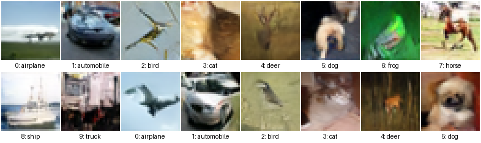
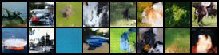
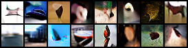
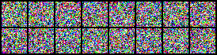

# Modular Diffusion

<p align="right">
English | <a href="README.zh-CN.md">中文</a>
</p>

A compact diffusion playground that maps the main ideas of DDPM, DDIM, latent
diffusion, and classifier-free guidance to small, readable PyTorch modules.

```text
CIFAR10 image or latent noise -> denoising network -> generated CIFAR10 sample
```

The repository is built as a learning-oriented implementation: each mathematical
part of diffusion has a corresponding module, and each experiment swaps one
piece of the system while keeping the surrounding interface stable.

For setup, data preparation, training, and sampling commands, see
[Documentation](Documentation/README.md).

## The Idea

Diffusion generation is trained by making clean data progressively noisier, then
learning a neural network that can undo that corruption at any noise level. The
forward process is fixed; the learnable part is the denoiser.

```math
x_t = \sqrt{\bar{\alpha}_t}x_0 + \sqrt{1-\bar{\alpha}_t}\epsilon,
\quad \epsilon \sim \mathcal{N}(0, I)
```

The noise schedule controls how quickly the signal disappears. In this project,
linear, cosine, and sigmoid schedules are implemented in
[`diffusion/schedules.py`](diffusion/schedules.py), while the forward diffusion
and posterior coefficients live in [`diffusion/processes.py`](diffusion/processes.py).

## Forward Diffusion Path

Training samples a clean image `x0`, a timestep `t`, and Gaussian noise
`epsilon`. The model receives the noisy tensor `x_t` and the timestep embedding,
then predicts one of three equivalent targets: noise, clean data, or velocity.

```math
\epsilon\text{-target}: \epsilon_\theta(x_t,t)
```

```math
x_0\text{-target}: \hat{x}_{0,\theta}(x_t,t)
```

```math
v\text{-target}: v_\theta(x_t,t)
```

The conversions between these targets are implemented in
[`diffusion/parameterizations.py`](diffusion/parameterizations.py). This keeps
the sampler independent from the chosen prediction target.

## The Training Objective

For the classic epsilon target, the loss is the mean squared error between the
sampled noise and the predicted noise:

```math
\mathcal{L}
= \mathbb{E}_{x_0,t,\epsilon}
\left\|\epsilon - \epsilon_\theta(x_t,t,c)\right\|^2
```

The optional condition `c` is a CIFAR10 class label. Classifier-free guidance is
trained by randomly replacing labels with a learned null condition, so the same
checkpoint can generate unconditional samples or guided class-conditional
samples.

The loss wrapper lives in [`diffusion/losses.py`](diffusion/losses.py), and the
training loop calls it from [`diffusion/train.py`](diffusion/train.py).

## Sampling

Sampling starts from Gaussian noise and repeatedly asks the denoiser how to move
toward cleaner data. The same denoiser can be used with a stochastic DDPM sampler
or a deterministic DDIM sampler.

```math
x_{t-1} = \mu_\theta(x_t,t) + \sigma_t z,
\quad z \sim \mathcal{N}(0,I)
```

```math
x_\tau =
\sqrt{\bar{\alpha}_\tau}\hat{x}_0
+ \sqrt{1-\bar{\alpha}_\tau}\hat{\epsilon}
```

Classifier-free guidance combines unconditional and conditional predictions:

```math
\mathrm{pred}
= \mathrm{pred}_{\mathrm{uncond}}
+ s\left(\mathrm{pred}_{\mathrm{cond}}
- \mathrm{pred}_{\mathrm{uncond}}\right)
```

The samplers are implemented in [`diffusion/samplers.py`](diffusion/samplers.py).
Checkpoint sampling always loads warmup EMA weights from `model_ema`.

## Pixel and Latent Diffusion

Pixel-space experiments denoise tensors directly in image space. The latent
experiment first uses a pretrained Diffusers `AutoencoderKL` to map CIFAR10
images into a compact latent tensor, then runs the same diffusion machinery in
that latent space.

```text
image -> VAE encoder -> latent -> diffusion denoiser -> latent -> VAE decoder -> image
```

Latent wrapping is handled by
[`diffusion/representations/latent.py`](diffusion/representations/latent.py), and
the Diffusers VAE adapter is in
[`diffusion/models/diffusers_autoencoder.py`](diffusion/models/diffusers_autoencoder.py).

## Relation to Nearby Methods

| Method | Learned object | Generation |
| --- | --- | --- |
| DDPM | noise or data prediction at discrete timesteps | stochastic reverse Markov chain |
| DDIM | same denoiser as DDPM | deterministic or lightly stochastic timestep jumps |
| Latent diffusion | denoising model in VAE latent space | decode the final latent back to pixels |
| This repository | interchangeable denoisers, schedules, targets, and samplers | CIFAR10 pixel and latent generation |

## Inside This Demo

The full experiment set uses CIFAR10 with classifier-free class conditioning.
All formal configs train for 100 epochs and save warmup EMA denoiser weights.

| Config | Space | Backbone | Schedule | Target | Sampler |
| --- | --- | --- | --- | --- | --- |
| [`configs/cifar10_mlp_ddpm.yaml`](configs/cifar10_mlp_ddpm.yaml) | pixel | MLP | linear | epsilon | DDPM |
| [`configs/cifar10_unet_ddpm.yaml`](configs/cifar10_unet_ddpm.yaml) | pixel | UNet | linear | epsilon | DDPM |
| [`configs/cifar10_dit_ddpm.yaml`](configs/cifar10_dit_ddpm.yaml) | pixel | DiT | linear | epsilon | DDPM |
| [`configs/cifar10_unet_sigmoid_ddpm.yaml`](configs/cifar10_unet_sigmoid_ddpm.yaml) | pixel | UNet | sigmoid | epsilon | DDPM |
| [`configs/cifar10_unet_x0_ddpm.yaml`](configs/cifar10_unet_x0_ddpm.yaml) | pixel | UNet | linear | x0 | DDPM |
| [`configs/cifar10_unet_cosine.yaml`](configs/cifar10_unet_cosine.yaml) | pixel | UNet | cosine | epsilon | DDIM |
| [`configs/cifar10_unet_snr_cosine.yaml`](configs/cifar10_unet_snr_cosine.yaml) | pixel | UNet | cosine | epsilon | DDIM |
| [`configs/latent_unet_ddim.yaml`](configs/latent_unet_ddim.yaml) | latent | UNet | cosine | v | DDIM |

Backbones live in [`diffusion/models/`](diffusion/models/), and component
construction is centralized in [`diffusion/builders.py`](diffusion/builders.py).

## Results

The images below are qualitative samples from the completed runs in
[`results/`](results). Conditional grids include CIFAR10 labels under each tile.

### UNet Cosine DDIM



### DiT DDPM



### Latent UNet DDIM



### MLP DDPM Failed Case



The MLP run is kept as a failed case rather than a baseline: flattening CIFAR10
removes the image locality bias that convolutional and patch-based models rely
on, and the resulting samples make that limitation visible.

## Takeaway

The repository keeps the diffusion system modular: the forward process defines
how data becomes noise, the denoiser predicts useful information at each noise
level, and the sampler decides how to turn those predictions back into data.

```math
x_t = a_t x_0 + s_t\epsilon
```

```math
\mathrm{sample}
= \mathrm{Sampler}\left(\mathrm{Denoiser}_\theta, x_T, c\right)
```
